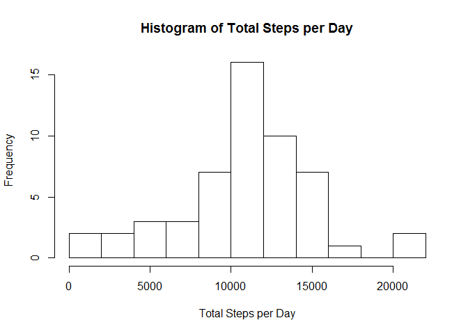
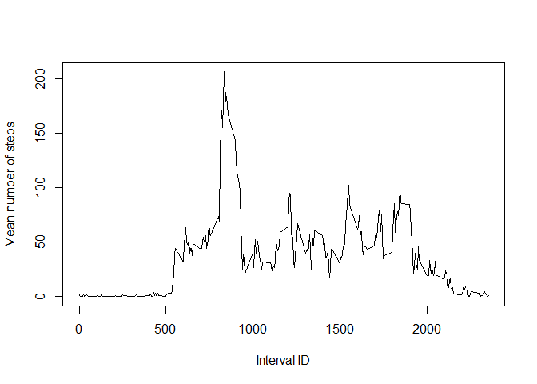
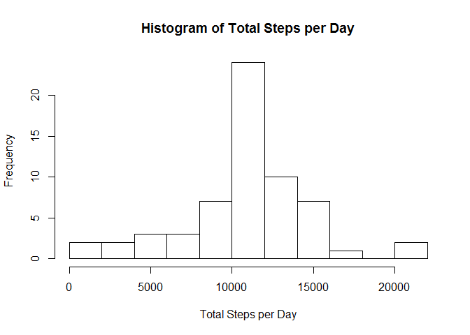
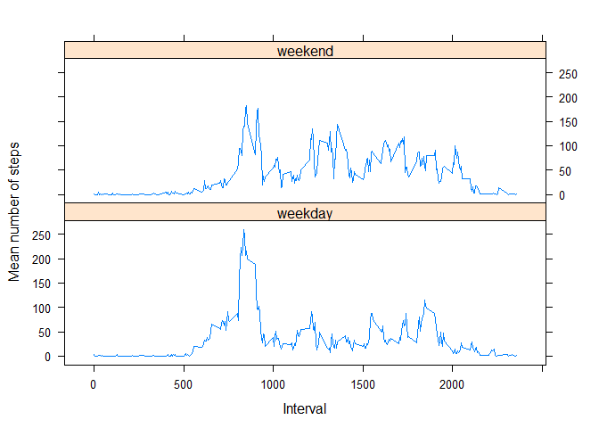

# Reproducible Research: Peer Assessment 1

## Loading and preprocessing the data

```r
setwd("C:\\Users\\Joe\\_LEARNING_todo\\___Data Science\\5 Reproducible Research\\Peer Assessment 1\\RepData_PeerAssessment1\\")
unzip("C:\\Users\\Joe\\_LEARNING_todo\\___Data Science\\5 Reproducible Research\\Peer Assessment 1\\RepData_PeerAssessment1\\activity.zip")

library(plyr)
library(dplyr)
library(lattice)

columnClass <- c("numeric","Date","numeric")

activityData <- read.csv("activity.csv", colClasses = columnClass)
activityDataLessNA <- na.omit(activityData)
```
## What is mean total number of steps taken per day?

```r
sumsByDate <- aggregate(steps ~ date, data=activityDataLessNA, sum)
hist(sumsByDate$steps, xlab="Total Steps per Day",breaks=10, main="Histogram of Total Steps per Day")
```

 

```r
meanSteps <- round(mean(sumsByDate$steps))
medianSteps <- median(sumsByDate$steps)

reportMeanSteps <- as.character(meanSteps)
reportMedianSteps <- as.character(medianSteps)
```
The mean number of steps taken per day is 10766.

The median number of steps taken per day is 10765.

## What is the average daily activity pattern?

```r
meanStepsByInterval <- aggregate(activityDataLessNA$steps, by=list(activityDataLessNA$interval), FUN=mean)

names(meanStepsByInterval) <- c("Interval","MeanSteps")

plot(meanStepsByInterval$Interval,meanStepsByInterval$MeanSteps,type="l", xlab="Interval ID", ylab="Mean number of steps")
```

 

```r
getIntervalMaxSteps <- meanStepsByInterval$Interval[which.max(meanStepsByInterval$MeanSteps)]
```
The interval that has the highest mean number of steps is 835.


## Imputing missing values

```r
totalNARows <- nrow(activityData) - nrow(activityDataLessNA)
```
The total number of rows with NAs is 2304.

Rows with NA will be imputed using the mean for that interval across all days.


```r
activityDataImputed <- activityData

toRow <- nrow(activityData)

for (i in 1:toRow) {
    
    if (is.na(activityDataImputed$steps[i])) {
        
        getMeanForInterval <- meanStepsByInterval$MeanSteps[meanStepsByInterval$Interval==activityData$interval[i]]
        
        activityDataImputed$steps[i] <- getMeanForInterval
    }
    
}

sumsByDateImputed <- aggregate(steps ~ date, data=activityDataImputed, sum)
hist(sumsByDateImputed$steps, xlab="Total Steps per Day",breaks=10, main="Histogram of Total Steps per Day")
```

 

```r
meanStepsImputed <- round(mean(sumsByDateImputed$steps))
medianStepsImputed <- median(sumsByDateImputed$steps)

reportMeanStepsImputed <- as.character(meanStepsImputed)
reportMedianStepsImputed <- as.character(medianStepsImputed)
```
The mean number of steps taken per day is 10766.

The median number of steps taken per day is 10766.1886792453.

The mean number of steps taken per day is the same for the data set excluded NA and the imputed data set. The median is slightly higher for the imputed data set.

## Are there differences in activity patterns between weekdays and weekends?

```r
activityDataImputed$Day <- weekdays(activityDataImputed$date)

toRow <- nrow(activityDataImputed)

for (i in 1:toRow) {
    if (activityDataImputed$Day[i]=="Saturday" | activityDataImputed$Day[i]=="Sunday") {
        activityDataImputed$Day[i] <- "Weekend"
    } else {
        activityDataImputed$Day[i] <- "Weekday"
    }    
}

activityDataImputed$Day <- as.factor(activityDataImputed$Day)


meanStepsByIntervalWeekday <- aggregate(activityDataImputed$steps[activityDataImputed$Day=="Weekday"], by=list(activityDataLessNA$interval[activityDataImputed$Day=="Weekday"]), FUN=mean)

meanStepsByIntervalWeekday$Day <- "weekday"

meanStepsByIntervalWeekend <- aggregate(activityDataImputed$steps[activityDataImputed$Day=="Weekend"], by=list(activityDataLessNA$interval[activityDataImputed$Day=="Weekend"]), FUN=mean)

meanStepsByIntervalWeekend$Day <- "weekend"

finalData <- rbind(meanStepsByIntervalWeekday,meanStepsByIntervalWeekend)

names(finalData) <- c("Interval","MeanSteps","Day")

xyplot(MeanSteps~Interval|Day,data=finalData,type="l",xlab="Interval", ylab="Mean number of steps",layout=c(1,2),Main="Mean Steps by Interval for Weekends and Weekdays")
```

 
